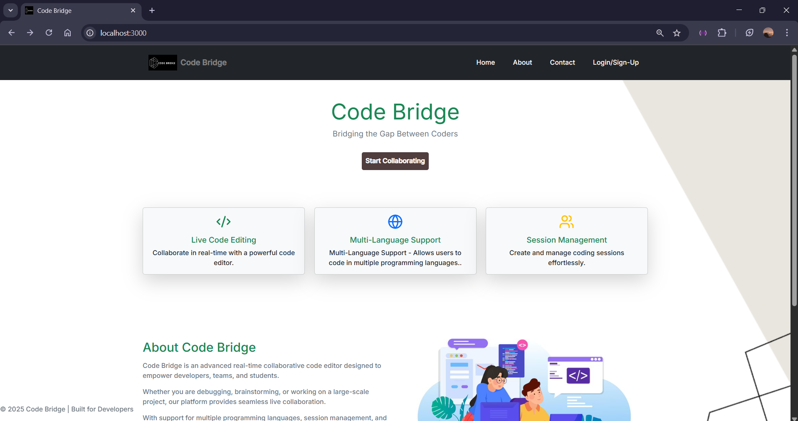
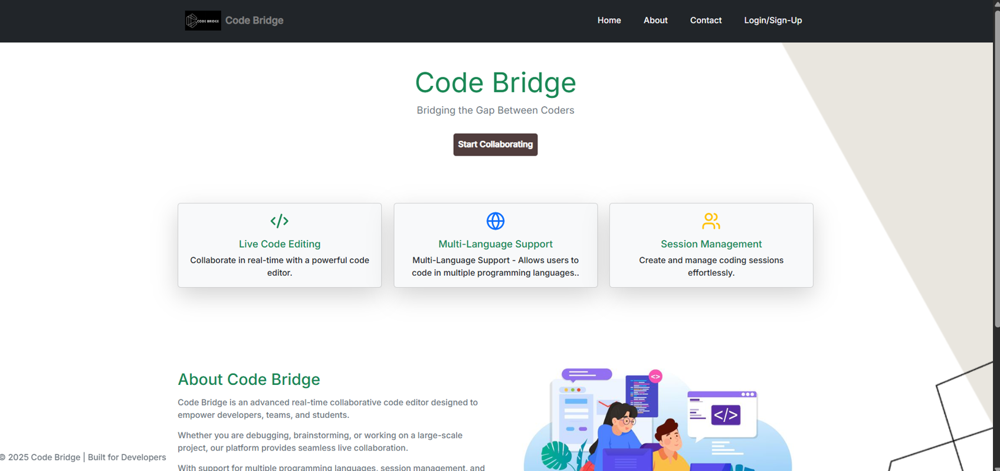
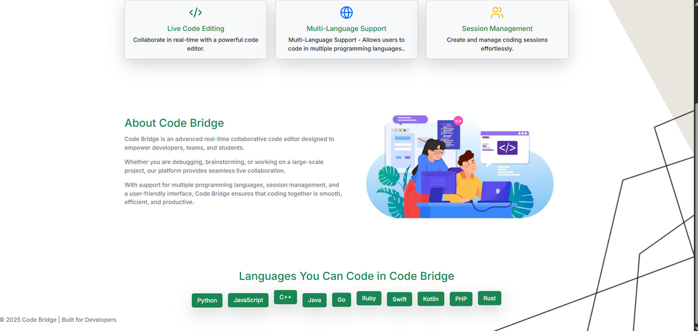
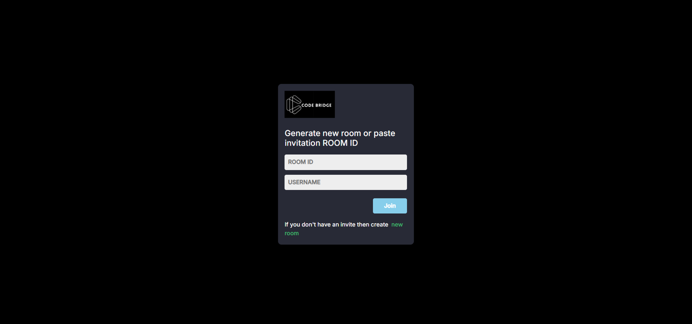
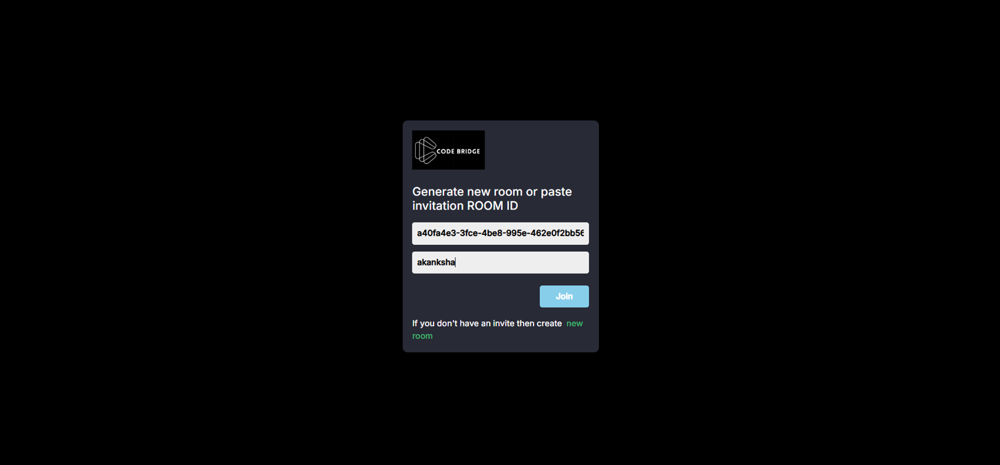

# 🌉 Code Bridge - Bridging the Gap Between Coders

**Code Bridge** is a real-time collaborative coding platform designed to empower developers, students, and teams to seamlessly collaborate on code from anywhere in the world. It provides a live code editor with integrated chat, creating a shared coding environment ideal for projects, interviews, or hackathons.

---

## 📌 Project Objectives

- Enable real-time, conflict-free collaborative code editing
- Provide a smooth, distraction-free user experience
- Encourage teamwork and knowledge sharing, even remotely
- Simplify collaboration for coding interviews, team projects, and learning environments

---

## 🧩 Existing System & Need for Code Bridge

### Existing System
- Most online editors target solo development
- Limited or poorly synchronized collaborative features
- Latency and performance bottlenecks

### Need for Code Bridge
✅ Real-time, low-latency collaboration  
✅ Integrated communication (chat)  
✅ A unified platform combining editing, messaging, and (optionally) code execution  
✅ Improved remote teamwork efficiency

---

## 🎯 Scope of Work

- **Frontend**:  
  - Modern React-based interface  
  - Integrated live code editor with syntax highlighting  
  - Responsive UI with chat capability

- **Backend**:  
  - Session management  
  - Secure user authentication  
  - Real-time code sync with WebSockets (Socket.IO)

- **Optional Enhancements**:  
  - Code execution sandbox  
  - Voice/video collaboration  
  - Role-based access control

---

## 🛠️ Technology Stack

| Component            | Technology                       |
|----------------------|----------------------------------|
| Frontend             | React.js, CSS                    |
| Code Editor          | CodeMirror                       |
| Backend              | Node.js, Express.js              |
| Real-time Messaging  | Socket.IO                        |
| Database             | MySQL (or MongoDB as alternative) |
| Package Manager      | npm                              |

---

---

## 📦 Module Specification

- **User Management Module**
  - Registration and secure login
  - Encrypted password storage

- **Session Management**
  - Create/join sessions via unique IDs
  - Store session metadata

- **Real-Time Editor**
  - Collaborative code editor with live updates
  - (Future) language selection

- **Collaboration Module**
  - WebSocket-based synchronization
  - Simultaneous editing support

- **Data Storage Module**
  - Store user profiles, session data, chat logs

- **(Optional) Code Execution Module**
  - Future integration of a code runner

---
## 🖼️ Pictures

    
    
    
    
    
    

## ⚙️ Database Tables

**1️⃣ User Collection**
| Field     | Type     | Description                     |
|-----------|----------|---------------------------------|
| user_id   | ObjectId | Unique identifier               |
| name      | String   | Name                            |
| email_id  | String   | Unique email                    |

**2️⃣ Room Collection**
| Field     | Type     | Description                           |
|-----------|----------|---------------------------------------|
| room_id   | ObjectId | Unique identifier                     |
| room_name | String   | Room title                            |
| created_by| ObjectId | user_id of the creator                |

**3️⃣ Participants Collection**
| Field          | Type     | Description              |
|----------------|----------|--------------------------|
| participant_id | ObjectId | Unique participant id    |
| user_id        | ObjectId | Reference to User        |
| room_id        | ObjectId | Reference to Room        |

**4️⃣ Code Updates Collection**
| Field        | Type     | Description                            |
|--------------|----------|----------------------------------------|
| code_id      | ObjectId | Unique identifier                      |
| user_id      | ObjectId | Reference to user                      |
| room_id      | ObjectId | Reference to room                      |
| code_content | String   | Actual code content                    |
| language     | String   | Programming language                   |

---

## ⚠️ Drawbacks & Limitations

- No built-in code execution environment yet only for javascript is available  
- No advanced role-based permissions    
- Synchronization delays possible under high load  
- Limited version history tracking  
- Could face scaling issues without optimization

---

## 🌟 Proposed Enhancements

✅ Integrated secure code execution sandbox  
✅ Voice/video communication tools  
✅ Advanced role-based access control (view-only / edit / admin)  
✅ Version history and rollback support  
✅ Performance tuning for high-traffic collaboration

---

## 🚀 Conclusion

Code Bridge provides a powerful, minimalistic, real-time collaborative coding experience, particularly well-suited for students, coding bootcamps, hackathons, and interviews. It promotes teamwork and engagement across distances, reducing the communication gap between coders.  

While already feature-rich, future enhancements like a code runner, improved role management, and richer media sharing will help Code Bridge scale into a complete remote development platform.

---

## 📚 References

- [MDN Web Docs](https://developer.mozilla.org/)  
- [ReactJS Docs](https://react.dev/)  
- [Node.js Docs](https://nodejs.org/)  
- [MongoDB Docs](https://www.mongodb.com/docs/)  
- [Socket.IO Docs](https://socket.io/)  
- [Stack Overflow](https://stackoverflow.com/)

---

👩‍💻 **Developed by:**  
Akanksha Job 
